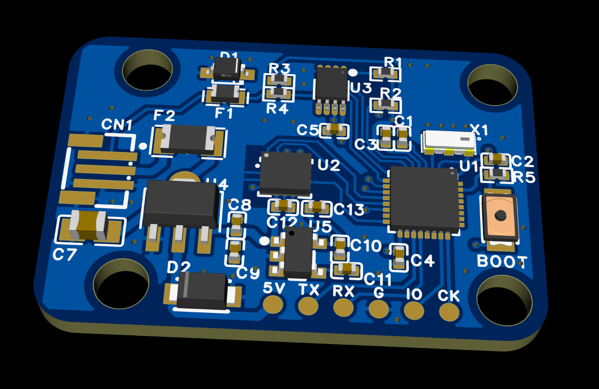
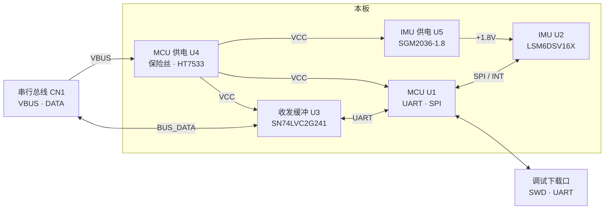
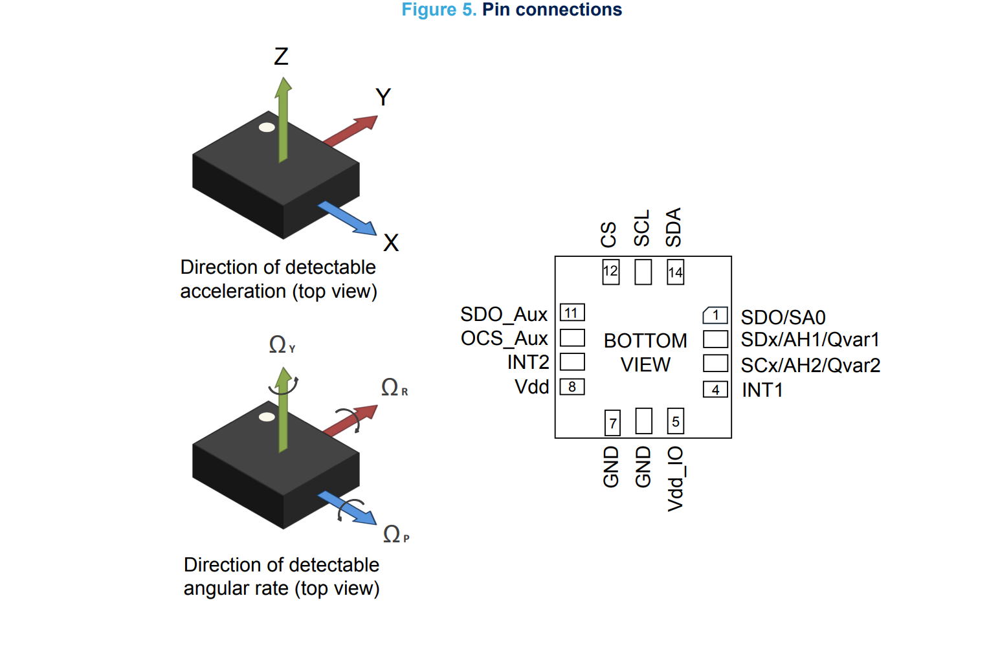
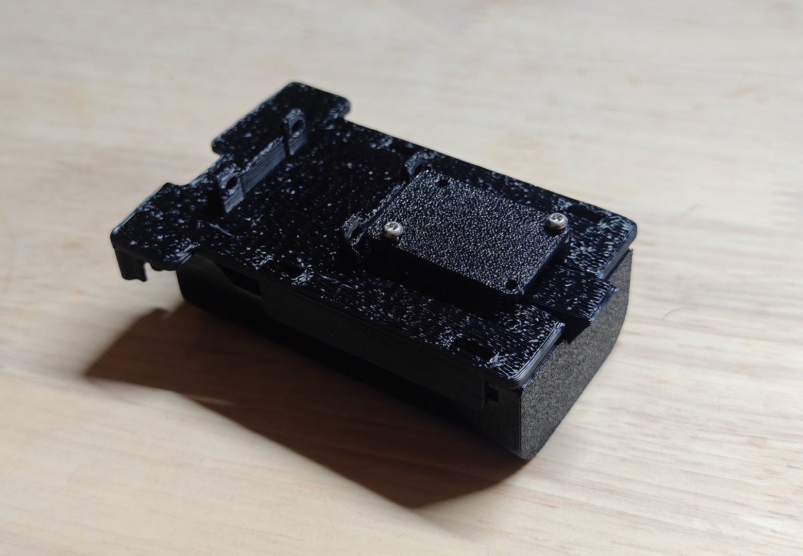

# MicroDuck IMU 板

[](LICENSE)

适用于 [MicroDuck](https://github.com/avanx/microduck_imu_to_ttl) 的 **Dynamixel 半双工总线 IMU 从板**（`imu_to_dxl`）。

[](docs/images/PCB.png)

立创平台 https://oshwhub.com/avanx/project_whiijerp

## 硬件框图



## 电路说明

### 电源

- `CN1` 的 `VBUS` 经自恢复保险丝进入 `HT7533`，得到 `VCC`，供给 MCU 和收发缓冲。
- `VCC` 再经 `SGM2036-1.8` 降到 `+1.8V`，只给 IMU。

### 信号

- `BUS_DATA` 经 TVS、PTC和 电阻 保护后，由 `SN74LVC2G241` 做半双工收发，接到 MCU 的 UART（含方向控制）。
- MCU 以 SPI（及 INT）连接 `LSM6DSV16X`。
- UART 用于串口烧录
- 调试口把 SWD 和 UART 引到板外，用于下载与串口调试。

## 设计推理

### 1. 躯干 IMU 安装朝向
从`microduck`主仓的实现看
对直立机器人（trunk 坐标系：**X 前、Y 左、Z 上**），IMU 芯片轴与躯干坐标系的对应为：

| 芯片轴 | 指向（trunk 系） |
|---|---|
| +Z（顶面法向） | 前方（+X） |
| +X | 下方（−Z） |
| +Y | 左侧（+Y） |

即：板面朝前竖装，芯片相对躯干绕 Y 轴转了 +90°。

#### 判定依据（代码）

1. **安装旋转常量**：`duck-control/src/imu.rs:78-83` — `DEFAULT_MOUNT` 四元数
   `[√½, 0, √½, 0]`（绕 Y 轴 +90°），注释明确写着
   `trunk = [+raw_z, +raw_y, −raw_x]`（`imu.rs:76-77`）。
2. **trunk 坐标系约定**：`duck-control/src/imu.rs:26-35` — `ImuData` 文档注明
   gyro/gravity 均为 trunk 系，直立时 gravity = `[0, 0, -1]` ⇒ +Z 朝上，
   右手系 ⇒ X 前、Y 左。
3. **旋转的实际应用点**：
   - 陀螺仪：`duck-control/src/imu.rs:109`（`rotate(self.mount, gyro_sensor)`）
   - SFLP 四元数：`duck-control/src/imu.rs:125-131`（芯片四元数右乘 `mount_inv`）
4. **该常量唯一生效**：`duck-control/src/imu.rs:69-73`（`Default` 即 `DEFAULT_MOUNT`）、
   `duck-control/src/bus.rs:128`（生产路径 `SflpDecoder::default()`），
   无任何配置覆盖——代码假设的正是这一种物理安装。
5. **与仿真一致性的佐证**：`kinematics/assets/alpha/robot_walk.xml:12` —
   MJCF `imu` site 的 quat 为单位（仿真中 IMU 直接按 trunk 对齐建模），
   实机 90° 的安装差由 `DEFAULT_MOUNT` 在解码端补齐，使两端数据落入同一约定。

#### 封装边与轴的对应（来自数据手册，非本仓库代码）

[](docs/images/lsm6dsv16x_direction.png)

据此，站在机器人**正前方**看芯片：顶部长边沿 +Y 延伸、指向机器人左侧
（观察者的右手边，注意镜像）；右侧短边沿 +X 方向、向下为正。

### 2. 躯干 IMU 安装位置

依据 `microduck_rl` 仿真模型判定。

#### 结论

- IMU 参考点 = `robot_walk.xml` 中 `trunk_base` body 内的 site **`imu`**:
  `pos = (-0.021, +0.0000664, -0.0146984) m, quat = 单位四元数`
  → 相对躯干原点**向后 21 mm、正中矢状面、向下 14.7 mm**，三轴与躯干坐标系对齐（无安装旋转）。
- 该点位于 **`power_support`（电池舱支架）** 的前板面上：过该点沿 x 轴的射线在
  x = −23 / −21 mm 穿过两道面 → 此处为 2 mm 厚板，前板面与 site 的 x 平面重合。
- site 是**两圈同心安装孔的公共圆心**（两圈圆心重合，偏差 < 0.3 mm）：

  | 孔圈 | 孔心半径 | 孔距（y × z） | 实测孔位（相对 site） |
  |---|---|---|---|
  | 小圈 | r ≈ 9.0 mm | 15.0 × 10.2 mm | (±7.5, +5.1) 等 |
  | 大圈 | r ≈ 12.7 mm | 21.1 × 14.0 mm | (±10.55, +7.0) 等，落在 Ø26 mm 圆形台阶边缘 |

- **选圈规则**：IMU 芯片始终对准圆心（= imu site），按载板孔距选圈——
  小型 IMU 载板（孔距 ~15×10 mm）→ 小圈；带 IMU 的主板（孔距 ~21×14 mm）→ 大圈。

#### 判断理由（证据链）

1. **传感器挂载**：`sensors.xml` 中两个 `<gyro>` 均引用 `site="imu"`；该 site 是
   Onshape "Frame imu" 导出的裸坐标架（无几何、无质量）。旁证：头部 `head_imu`
   site 距 `elec_rpi_robot_hat_pcb` 板面仅 1.8 mm → 该 CAD 的惯例是
   **frame 点 = 真实 PCB 上 IMU 芯片的位置**。
2. **载体判定**：site 到各零件网格最近距离 —— power_support **3.4 mm**（且点落在
   其包围盒内）、电池（np_f970）6.6 mm、主框架 14.9 mm、xl330 舵机 15.8 mm
   → IMU 安装载体是 power_support。
3. **板面判定**：射线交点 x = −23/−21 → site 恰在前板面上（板厚 2 mm）。
4. **孔位判定**：顶点半径直方图在 r = 8.2–9.8 与 12.2–14.2 mm 出现峰（孔缘环带）；
   穿透射线 0 穿透区给出孔心 (±7.5, +5.1)、(±10.55, +7.0)，两圈孔与 site 的
   方位角一致（±33.5° / ±146.5°）→ **同心双孔圈，圆心 = imu site**。
5. **排除项**：banana_pcb_locker 是顶部后侧压条（距 site ~50 mm）、电池在正后方
   6.6 mm、头部件无关 → 均非 IMU 载体。

#### 判断方法（可复现步骤）

环境：`cd microduck_rl && uv run python`

1. **读传感器挂载**：在 `robot_*.xml` 搜 `<gyro ... site=...>` / `<site name="imu" ...>`。
2. **求最近零件**（定位载体）：

   ```python
   m = mujoco.MjModel.from_xml_path("src/mjlab_microdu.xml")
   d = mujoco.MjData(m); mujoco.mj_forward(m, d)          # 默认姿态 = CAD 装配姿态
   p = d.site_xpos[mujoco.mj_name2id(m, mujoco.mjtObj.mjOBJ_SITE, "imu")]
   # 对每个 mesh geom: 顶点世界化 → 到 p 的最小距离
   R = np.array(d.geom_xmat[g]).reshape(3, 3)
   wv = m.mesh_vert[adr:adr+num] @ R.T + d.geom_xpos[g]
   dist = np.linalg.norm(wv - p, axis=1).min()
   ```

   注意：`mesh_face` 索引是网格内局部索引；geom 类型用 `m.geom_type == mjGEOM_MESH`、
   网格 id 用 `m.geom_dataid`。
3. 求板面：对 site 的 (y, z) 沿 ±x 投射线（Möller–Trumbore 三角求交），记录交点 x。
4. 求孔位：
   - 通孔：细网格（0.25–0.5 mm）穿透射线，hit-count 图中「0 穿透」区为孔心；
   - 单面盲孔：从 +x 方向 first-hit 深度图，深度突降区 = 前壁孔；
   - 孔圈半径：所有顶点相对 site 的 `r = hypot(dy, dz)` 直方图，峰 = 孔缘环带。
5. 验证同心：各孔心到 site 的 r、θ 一致性（同一圈孔的 r 应接近）。

### 3. 最终结论

1.根据上述两个仓库的代码判断IMU板应该位于`power_support`组件上，`power_support`组件上有对应安装的孔位使用其中21.9 x 14.9 mm的孔位设计PCB
2.为了尽量减少电流产热对IMU精度的影响，该板最终作为总线上的一个叶子节点，同时为了满足上述尺寸要求，只设计一个接口
3.对于DXL和飞特不同的总线定义，交换接入板子的转接线的端子排序即可

#### 打印假组测试
[](docs/images/assemble_test.jpg)

## 状态

| 项目 | 状态 |
|---|---|
| PCB 设计 | 完成 |
| PCB上电测试 | 完成 |
| 飞特 SCS 固件 | 完成PC调试，等待上机 |
| DXL 舵机总线 | TODO |

## 许可

Copyright 2026 avanx

本项目采用 [Apache License 2.0](LICENSE)。你可以自由使用、修改和再分发，但须保留版权与许可声明；贡献默认按同一许可证提交。
